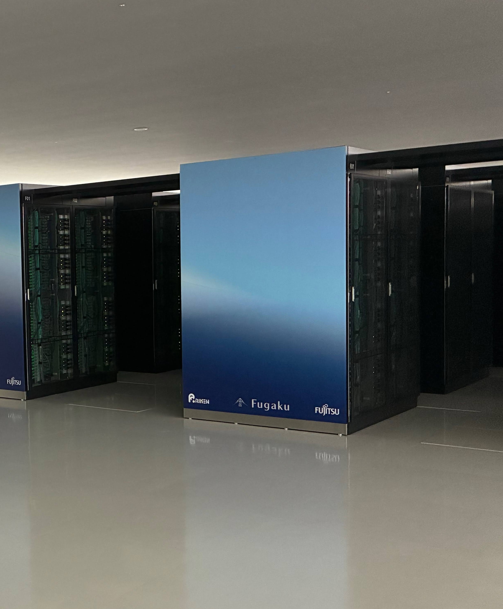
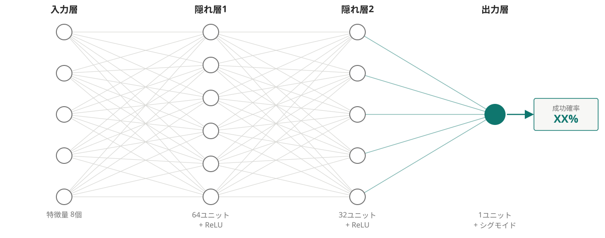

<!-- _class: lead -->

FUGAKU JOB SUCCESS PREDICTOR

# 富岳ジョブ成功率 予測Webアプリ

ジョブを投入する前に、成功確率をニューラルネットワークで予測する

GitHub: <a href="https://github.com/c-haruto/fugaku-job-success-predictor">c-haruto/fugaku-job-success-predictor</a>

<!--
発表者メモ:
・自己紹介、発表時間の目安などをここに書く
-->

---

## 【2】目的

- スーパーコンピュータ「富岳」では、ジョブが**失敗して終了**すると、
  確保していた計算資源・時間がそのまま無駄になってしまう
- 「投入する前に、この設定で成功しそうかどうか分かれば」という発想からスタート
- ノード数・実行時間・メモリ上限などの**投入条件だけ**から、
  そのジョブが成功するかをその場で予測するツールを作った

---

## 【3】技術説明 ①: ニューラルネットワークの仕組み

**使用データ**: F-DATA（富岳の実ジョブ実行ログ、約37ヶ月分・約2500万件）を学習に使用。多層パーセプトロン（MLP）による二値分類（成功/失敗）

正解とのズレ（損失）を誤差逆伝播法で計算し、重みを少しずつ調整して学習する

---

## 【3】技術説明 ②: 学習の工夫とシステム構成

- **クラス不均衡対策**: 少数派の失敗クラスの損失を重み付けして学習
- **確率較正（Platt scaling）**: 検証データで確率を較正し、
  「成功確率○%」が実際の成功率に近づくよう補正
- **データリーク防止**: 実行後にしか分からない情報
  （消費電力・実行時間など）は不使用。ユーザーID・ジョブ実行環境も、
  実運用で意味を持たない/時期依存で不安定と判明し除外
- **構成**: ブラウザ(HTML/JS) → FastAPI → PyTorchモデル+較正器 → 確率を返す

---

## 【4】このアプリができること（デモ）

<!-- ここはデモに合わせて自由に編集してください -->

- ノード数・要求時間・メモリ上限・周波数・投入時刻を入力すると、
  その場で成功確率が表示される
- 条件を変えると確率がどう動くか、その場で比較できる

---

## 【5】感想

- 実際にR-CCSを訪れた経験を、このWebアプリの制作に活かせたことが楽しかった
- 直近の生の運用データも学習に使いたかったが、匿名化が期間内に間に合わず実現できなかった
- データの性質上の限界はあるものの、富岳の運用状況は急変することがあるため、今後はそれにインタラクティブに対応できるようなアプリへと発展させたいと思った
