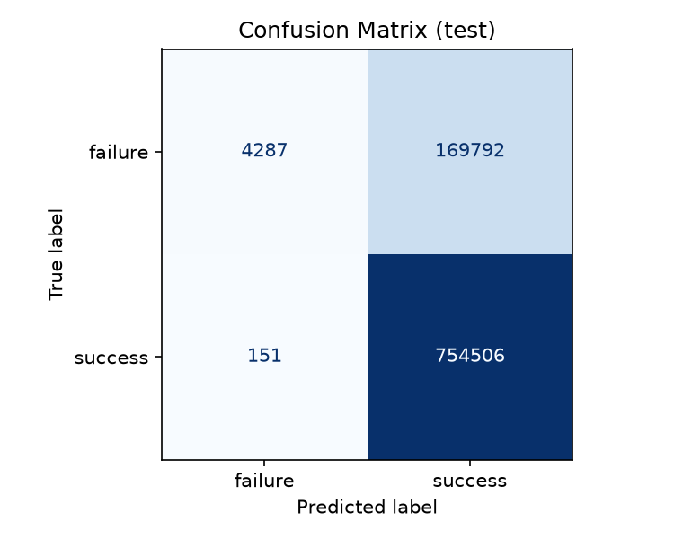
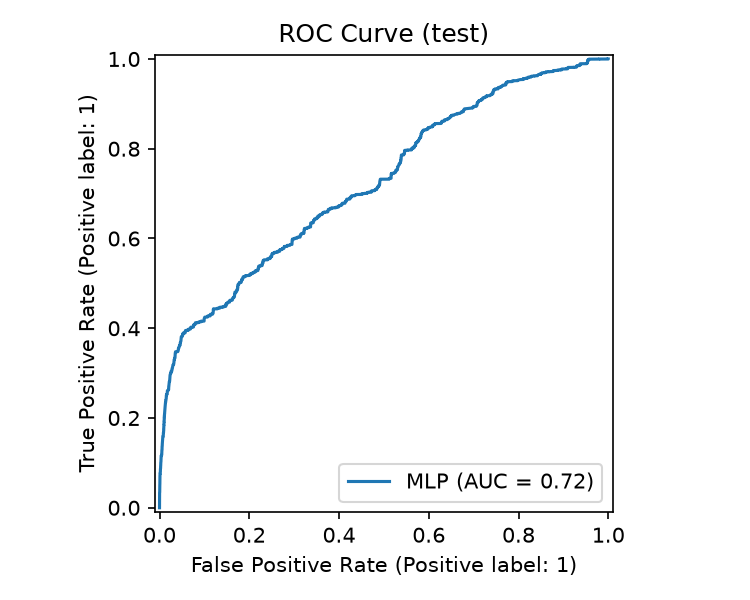
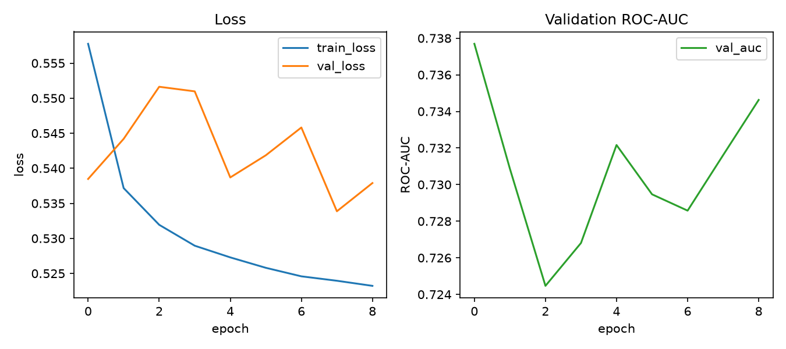

# 学習・評価レポート

- 学習データ: 21_04.parquet 〜 23_12.parquet（33ファイル）
- 検証データ（学習期間より未来）: ['24_01.parquet', '24_02.parquet']
- テストデータ（検証期間よりさらに未来）: ['24_03.parquet', '24_04.parquet']
- train件数: 22,849,273 / val件数: 1,375,274 / test件数: 928,736
- testデータの成功率（クラス比）: 0.813
- 使用した特徴量: ['nnumr_log', 'elpl_hours', 'node_hours_log', 'mszl_specified', 'mszl_gib_log', 'submit_hour', 'submit_dow', 'freq_req']

使用する特徴量は、ジョブ投入時点で確実に分かる情報だけに限定している（特徴量の選定方針は docs/feature_leakage.md を参照）。

## テストセットでの評価指標

| 指標 | 値 |
|---|---|
| Accuracy | 0.8170 |
| ROC-AUC | 0.7246 |
| Precision (success) | 0.8163 |
| Recall (success) | 0.9998 |
| F1 (success) | 0.8988 |
| Precision (failure) | 0.9660 |
| Recall (failure) | 0.0246 |
| F1 (failure) | 0.0480 |

failure（失敗）はクラス不均衡で少数派のため、AccuracyだけでなくfailureクラスのPrecision/Recallも重視して評価している。

## 確率の較正（Platt scaling）

クラス不均衡対策の重み付き損失は順位付け（ROC-AUC）の改善には有効だが、副作用として出力される確率の値そのものが歪む（実際より低い成功確率を出しがちになる）。本アプリは「成功確率〇%」をそのまま画面に表示するため、検証(val)セットの生ロジットを使ってPlatt scaling（1次元のロジスティック回帰によるスケーリング）を行い、較正後の確率を最終出力としている（`src/models/calibrator.joblib`）。

| 指標 | 較正前 | 較正後 |
|---|---|---|
| テストセットでの平均予測確率 | 0.586 | 0.907 |
| Brierスコア（小さいほど良い） | 0.1960 | 0.1491 |

（参考: テストセットの実際の成功率は 0.813）

## 混同行列・ROC曲線・学習曲線







## sklearn classification_report

```
{
  "failure(0)": {
    "precision": 0.9659756647138351,
    "recall": 0.02462674992388513,
    "f1-score": 0.04802903925116375,
    "support": 174079.0
  },
  "success(1)": {
    "precision": 0.8163016689422675,
    "recall": 0.9997999090977755,
    "f1-score": 0.8987804914366376,
    "support": 754657.0
  },
  "accuracy": 0.8170168917754884,
  "macro avg": {
    "precision": 0.8911386668280513,
    "recall": 0.5122133295108303,
    "f1-score": 0.4734047653439007,
    "support": 928736.0
  },
  "weighted avg": {
    "precision": 0.8443560347791886,
    "recall": 0.8170168917754884,
    "f1-score": 0.7393186400116956,
    "support": 928736.0
  }
}
```